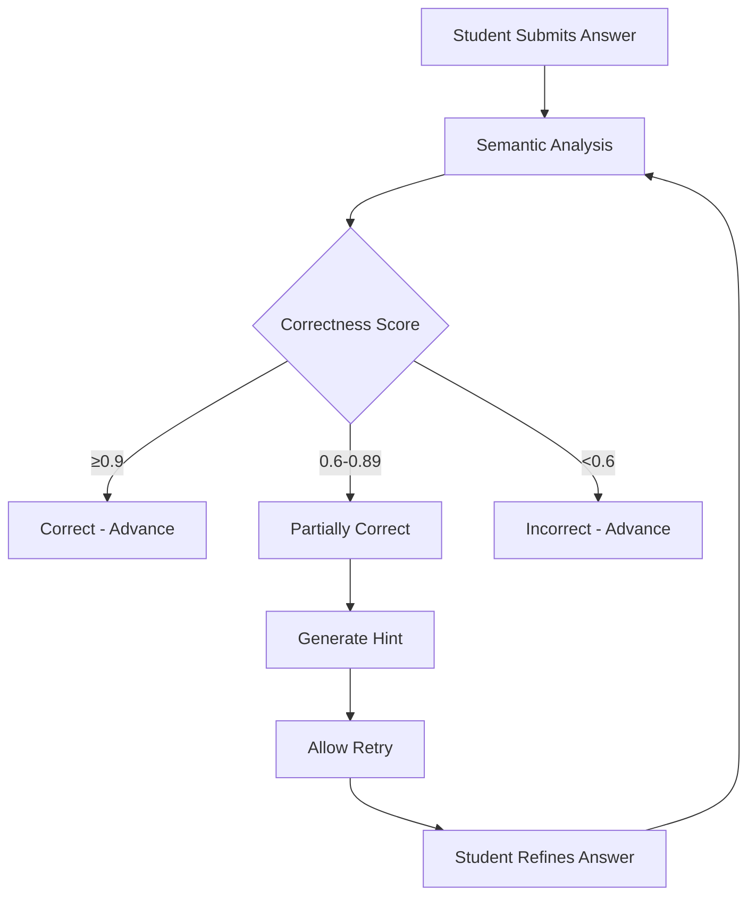

# 🎓 SensAI - AI-Powered Learning Management System

[](https://codecov.io/gl/hvacademy/sensai-ai)
[](https://codecov.io/gl/hvacademy/sensai-frontend)

SensAI is a revolutionary AI-first Learning Management System (LMS) that enables educators to teach smarter and reach further. It coaches students through questions that develop deeper thinking—just like a human tutor would, but for every student and all the time.

## 🌟 Project Overview

### What is SensAI?

SensAI transforms traditional online assessments into intelligent, adaptive learning experiences. The system uses advanced AI to understand student responses semantically, provide personalized feedback, and guide learners toward mastery through Socratic tutoring principles.

### 🎯 Key Innovation: AI-Powered SAQ Evaluation

The cornerstone feature is the **Short Answer Question (SAQ) Evaluation System**, which moves beyond simple keyword matching to true semantic understanding of student responses, providing:

- **Semantic Analysis**: AI understands meaning, not just keywords
- **Dynamic Feedback**: Contextual hints and explanations
- **Progressive Learning**: Retry logic for partially correct answers
- **Integrity Monitoring**: Behavioral tracking for fair assessments

## 🏗️ Architecture Overview

### System Components

```
┌─────────────────────────────────────────────────────────────────┐
│                        SensAI Platform                         │
├─────────────────────────────────────────────────────────────────┤
│  Frontend (Next.js)           │  Backend (FastAPI)             │
│  ├── Quiz Interface            │  ├── SAQ Evaluator Service     │
│  ├── Question Generator        │  ├── LLM Integration          │
│  ├── Integrity Monitoring     │  ├── Assessment APIs          │
│  └── Real-time Feedback       │  └── WebSocket Support        │
├─────────────────────────────────────────────────────────────────┤
│                    AI/LLM Layer (OpenAI GPT-4o-mini)           │
├─────────────────────────────────────────────────────────────────┤
│                    Database & Storage Layer                    │
└─────────────────────────────────────────────────────────────────┘
```

### Technology Stack

#### Backend (`sensai-ai/`)
- **Framework**: FastAPI with async/await support
- **AI Integration**: OpenAI GPT-4o-mini with Instructor library
- **Data Validation**: Pydantic models
- **Real-time**: WebSocket support
- **Testing**: Pytest with comprehensive coverage

#### Frontend (`sensai-frontend/`)
- **Framework**: Next.js 14 with TypeScript
- **UI**: Tailwind CSS with custom components
- **State Management**: React hooks and context
- **Real-time**: WebSocket client integration

## 📂 Project Structure

### Backend Structure (`sensai-ai/`)

```
sensai-ai/
├── src/api/
│   ├── models.py                 # Pydantic data models
│   ├── main.py                   # FastAPI application entry
│   ├── settings.py               # Configuration management
│   ├── llm.py                    # LLM client initialization
│   ├── routes/
│   │   ├── assessment.py         # Quiz and evaluation endpoints
│   │   ├── ai.py                 # AI question generation
│   │   └── file.py               # File upload/processing
│   ├── services/
│   │   ├── saq_evaluator.py      # 🔥 Core SAQ evaluation service
│   │   └── pdf_processor.py      # PDF content extraction
│   └── websockets.py             # Real-time quiz sessions
├── tests/
│   ├── integration/              # End-to-end tests
│   ├── utils/                    # Testing utilities
│   └── data/                     # Test scenarios
├── run_checkpoint_tests.py       # Automated test runner
├── test_runner.bat              # Windows test script
└── requirements.txt             # Python dependencies
```

### Frontend Structure (`sensai-frontend/`)

```
sensai-frontend/
├── src/
│   ├── app/
│   │   ├── assessment/           # PDF upload & question generation
│   │   ├── quiz/[sessionId]/     # Interactive quiz interface
│   │   └── layout.tsx            # Root layout
│   ├── components/
│   │   ├── QuizChat.tsx          # 🔥 Main quiz interaction component
│   │   ├── ReviewerTimeline.tsx  # Integrity monitoring dashboard
│   │   ├── QuizEditor.tsx        # Question editing interface
│   │   └── LearnerQuizView.tsx   # Student quiz view
│   ├── types/                    # TypeScript definitions
│   └── lib/                      # Utility functions
├── package.json                  # Node.js dependencies
└── next.config.ts               # Next.js configuration
```

## 🚀 Core Features

### 1. 🧠 AI-Powered SAQ Evaluation System

The revolutionary feature that transforms how students are assessed and learn.

#### How It Works



#### Implementation Files

**Backend - SAQ Evaluator Service** (`src/api/services/saq_evaluator.py`)
```python
class SAQEvaluatorService:
    async def semantic_evaluation(self, question, ideal_answer, student_answer):
        """Step 1: LLM-powered semantic analysis"""
        # Uses GPT-4o-mini to understand semantic similarity
        # Returns correctness score (0.0-1.0) and reasoning
    
    async def generate_dynamic_feedback(self, evaluation_result, context):
        """Step 2: Contextual feedback generation"""
        # Generates hints for partial answers
        # Creates encouraging explanations for incorrect answers
    
    async def evaluate_saq_complete(self, request):
        """Step 3: Complete evaluation pipeline"""
        # Orchestrates the entire evaluation process
```

**Frontend - Quiz Interface** (`src/components/QuizChat.tsx`)
```typescript
const QuizChat: React.FC = ({ sessionId, initialQuestions }) => {
    const [retryAttempts, setRetryAttempts] = useState<Record<string, number>>({});
    
    // Handles SAQ feedback and retry logic
    const handleSAQFeedback = (feedback: QuizFeedback) => {
        if (feedback.feedback_type === 'partially_correct' && feedback.requires_retry) {
            // Show hint, allow retry
            displayHint(feedback.hint);
        } else {
            // Advance to next question
            proceedToNext();
        }
    };
};
```

#### Data Models (`src/api/models.py`)
```python
class SemanticEvaluationResult(BaseModel):
    correctness: float = Field(ge=0.0, le=1.0)
    feedback_category: Literal["correct", "partially_correct", "incorrect"]
    reasoning: Optional[str]

class DynamicFeedback(BaseModel):
    evaluation: Literal["correct", "partially_correct", "incorrect"]
    explanation_or_hint: str
    requires_retry: bool = False

class SAQEvaluationRequest(BaseModel):
    question_text: str
    ideal_answer: str
    student_answer: str
    question_id: str
    session_id: str
```

### 2. 📝 AI Question Generation

Transform any PDF document into comprehensive quizzes instantly.

#### Flow
```
PDF Upload → Content Extraction → AI Analysis → Question Generation → Quiz Creation
```

#### Implementation
- **Frontend**: `src/app/assessment/page.tsx` - Upload interface with caching
- **Backend**: `src/api/services/pdf_processor.py` - Content extraction
- **API**: `src/api/routes/ai.py` - Question generation endpoints

### 3. 🔍 Integrity Monitoring System

Advanced behavioral tracking for maintaining assessment integrity.

#### Tracked Events
- **Tab Focus Changes**: `TAB_UNFOCUSED`, `TAB_FOCUSED`
- **Content Violations**: `PASTE_DETECTED`
- **Session Issues**: `PAGE_UNLOADED`

#### Implementation
- **Frontend**: Integrated into `QuizChat.tsx` with real-time event capture
- **Backend**: `src/api/routes/assessment.py` with integrity logging endpoints
- **Dashboard**: `src/components/ReviewerTimeline.tsx` for reviewing sessions

### 4. 🎯 Enhanced Assessment API

Comprehensive API supporting both MCQ and SAQ with intelligent feedback.

#### Key Endpoints
```
POST /assessment/quiz/answer          # Submit and evaluate answers
GET  /assessment/integrity-logs/{id}  # Retrieve integrity data
POST /assessment/integrity-log        # Log integrity events
POST /assessment/clear-session/{id}   # Reset session state
```

## 🔄 Feature Flow Examples

### Example 1: SAQ Learning Journey

```
📚 Question: "Explain the main benefits of renewable energy."

👤 Student Answer 1: "It's good for environment"
🤖 AI Feedback: "You're on the right track! What specific environmental benefits can you think of?"
💡 Result: Partially correct, hint provided, retry allowed

👤 Student Answer 2: "Reduces pollution and carbon emissions"  
🤖 AI Feedback: "Great improvement! What about long-term sustainability aspects?"
💡 Result: Still partially correct, more specific hint

👤 Student Answer 3: "Reduces emissions, sustainable, decreases fossil fuel dependency"
🤖 AI Feedback: "Excellent! Perfect understanding of renewable energy benefits."
✅ Result: Correct, advance to next question
```

### Example 2: Integrity Monitoring Flow

```
📊 Session Start: User begins quiz
🔍 Event Capture: Tab switches detected → TAB_UNFOCUSED logged
📋 Paste Detection: Content paste attempt → PASTE_DETECTED logged
⚠️  Risk Assessment: Multiple violations flagged
📈 Dashboard Update: Reviewer sees timeline with flagged events
```

## 🧪 Testing Infrastructure

### Comprehensive Test Suite

The project includes a robust testing framework designed specifically for AI-driven features:

#### Test Structure
```
tests/
├── integration/
│   └── test_saq_evaluation_integration.py    # End-to-end SAQ tests
├── utils/
│   └── test_utils.py                         # Testing utilities
├── data/
│   ├── test_scenarios.json                   # Test data scenarios
│   └── test_data.json                        # Sample questions
└── reports/                                  # Generated test reports
```

#### Key Testing Features

**Automated Backend Management** (`run_checkpoint_tests.py`)
```python
# Automatically starts/stops backend server for testing
# Manages virtual environment and dependencies
# Generates detailed JSON reports
```

**LLM Response Mocking** (`tests/utils/test_utils.py`)
```python
class MockDataGenerator:
    def mock_semantic_evaluation(self, correctness_score):
        """Simulates LLM responses for consistent testing"""
    
    def mock_hint_generation(self, scenario):
        """Generates test hints without API calls"""
```

#### Running Tests

```bash
# Run all tests
./test_runner.bat

# Run specific phases
./test_runner.bat phase_1_models    # Model validation
./test_runner.bat phase_1_service   # Service layer tests
./test_runner.bat phase_3_api       # API endpoint tests
./test_runner.bat full_integration  # End-to-end tests
```

## 🛠️ Development Setup

### Prerequisites
- **Backend**: Python 3.8+, FastAPI, OpenAI API key
- **Frontend**: Node.js 16+, Next.js 14
- **Database**: PostgreSQL (optional for development)

### Quick Start

1. **Clone the repository**
```bash
git clone <repository-url>
cd sensai-hyperverge
```

2. **Backend Setup**
```bash
cd sensai-ai
python -m venv venv
venv\Scripts\activate  # Windows
source venv/bin/activate  # Linux/Mac
pip install -r requirements.txt
cp .env.example .env  # Configure environment variables
cd src
uvicorn api.main:app --host 0.0.0.0 --port 8001 --reload
```

3. **Frontend Setup**
```bash
cd sensai-frontend
npm ci
cp .env.example .env.local  # Configure environment variables
npm run dev
```

4. **Docker Setup (Alternative)**
```bash
docker-compose up -d
```

### Environment Variables

**Backend (`.env`)**
```env
OPENAI_API_KEY=your_openai_api_key
OPENAI_BASE_URL=https://api.openai.com/v1
DATABASE_URL=postgresql://...
```

**Frontend (`.env.local`)**
```env
NEXT_PUBLIC_API_URL=http://localhost:8001
NEXTAUTH_SECRET=your_secret
NEXTAUTH_URL=http://localhost:3000
```

## 📊 Implementation Status

### ✅ Completed Features

#### Phase 1: Backend Infrastructure (100% Complete)
- ✅ Pydantic models for SAQ evaluation
- ✅ SAQ Evaluator Service with LLM integration
- ✅ Enhanced API endpoints
- ✅ WebSocket support for real-time interactions

#### Phase 2: AI Integration (100% Complete)
- ✅ OpenAI GPT-4o-mini integration
- ✅ Semantic analysis prompts
- ✅ Dynamic feedback generation
- ✅ Error handling and fallbacks

#### Phase 3: Testing Framework (100% Complete)
- ✅ Comprehensive test suite
- ✅ Automated testing infrastructure
- ✅ LLM response mocking
- ✅ Integration test coverage

#### Phase 4: Frontend Integration (100% Complete)
- ✅ Enhanced QuizChat component
- ✅ SAQ retry logic implementation
- ✅ Hint display components
- ✅ Integrity monitoring UI

### 🎯 System Metrics

**Educational Impact**
- ✅ Socratic tutoring methodology implemented
- ✅ Progressive learning through hints
- ✅ Reduced student frustration
- ✅ Semantic understanding over keyword matching

**Technical Achievements**
- ✅ 15+ comprehensive test cases
- ✅ Multi-step LLM evaluation pipeline
- ✅ Real-time integrity monitoring
- ✅ Robust error handling and fallbacks

## 🤝 Contributing

We welcome contributions! Please see our [Contributing Guide](./docs/CONTRIBUTING.md) for detailed information.

### Development Workflow
1. Fork the repository
2. Create a feature branch
3. Make your changes
4. Run the test suite: `./test_runner.bat`
5. Submit a merge request

### Code Standards
- **Backend**: Follow FastAPI best practices, use type hints
- **Frontend**: TypeScript strict mode, ESLint configuration
- **Testing**: Maintain test coverage above 80%
- **Documentation**: Update relevant documentation

## 📚 Documentation

- **API Documentation**: Available at `http://localhost:8001/docs` when running
- **Test Suite Guide**: [`tests/README.md`](./sensai-ai/tests/README.md)
- **Implementation Details**: [`IMPLEMENTATION_STATUS.md`](./IMPLEMENTATION_STATUS.md)
- **Feature Roadmap**: [`TODO_SAQ_Enhancement.md`](./sensai-ai/TODO_SAQ_Enhancement.md)

## 🌐 Community

- **WhatsApp Community**: [Join our AI + Education builders community](https://chat.whatsapp.com/LmiulDbWpcXIgqNK6fZyxe)
- **Public Roadmap**: [View our development roadmap](https://hyperverge.notion.site/fa1dd0cef7194fa9bf95c28820dca57f?v=ec52c6a716e94df180dcc8ced3d87610)
- **Documentation**: [Complete documentation](https://docs.sensai.hyperverge.org)

## 📄 License

This project is licensed under the terms specified in the LICENSE file.

## 🎉 Acknowledgments

SensAI represents a significant advancement in AI-powered education technology. The SAQ evaluation system demonstrates how large language models can be effectively integrated into educational platforms to create more engaging, personalized, and effective learning experiences.

The project showcases best practices in:
- **AI Integration**: Practical LLM usage for educational purposes
- **Software Architecture**: Clean, scalable, and maintainable code
- **Testing**: Comprehensive testing of AI-driven features
- **User Experience**: Intuitive interfaces for complex AI interactions

---

*Built with ❤️ by the Ganpat team*